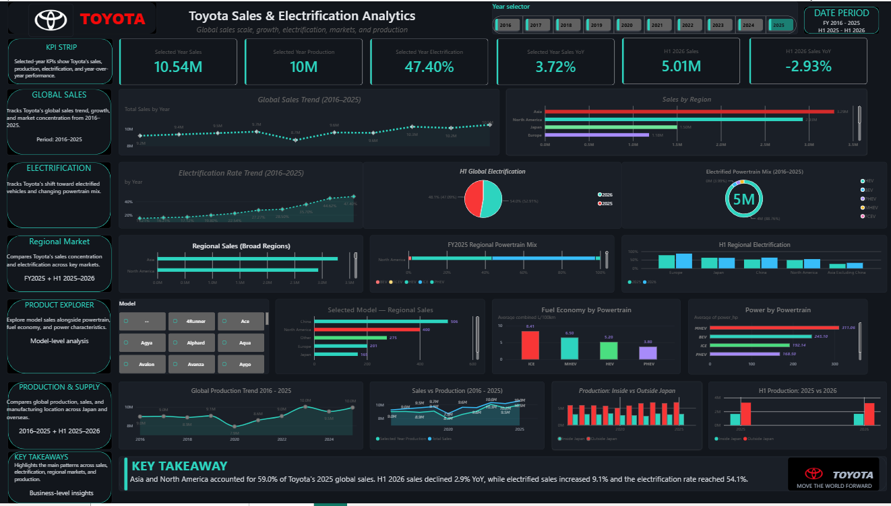

# Toyota Sales & Electrification Analytics

An end-to-end data analytics project analyzing Toyota's global sales, regional performance, electrification, major model sales, and production trends using Python, MySQL, SQL, and Power BI.

## Project Overview

This project analyzes Toyota's sales and production performance using official Toyota reports covering 2016–2025, with additional H1 2025 vs H1 2026 analysis.

The project focuses on:

- Global sales trends
- Regional sales performance
- Electrification trends
- Powertrain mix
- H1 2025 vs H1 2026 performance
- Major model sales
- Vehicle powertrain and fuel-economy characteristics
- Global production trends
- Production inside vs outside Japan

## Tech Stack

- Python
- Pandas
- NumPy
- MySQL
- SQL
- Power BI
- DAX

## Project Workflow

```text
Official Toyota Reports
        ↓
Python Data Preparation
        ↓
MySQL Analytical Database
        ↓
SQL Analysis
        ↓
Power BI Data Model
        ↓
DAX Measures
        ↓
Interactive Dashboard
```

Key Findings
Toyota global sales reached approximately 10.54 million units in 2025.
Asia and North America accounted for 59.0% of Toyota's 2025 global sales.
Toyota's 2025 global electrification rate reached 47.4%.
H1 2026 total sales declined 2.9% YoY.
H1 2026 electrified sales increased 9.1% YoY.
H1 2026 electrification rate reached 54.1%.
H1 2026 BEV sales increased 135.3% YoY.
Toyota's 2025 production reached approximately 9.95 million vehicles.
67.1% of 2025 production occurred outside Japan.
Dashboard

The Power BI dashboard includes:

Global Sales Analysis
Electrification Analysis
Regional Market Analysis
Product Explorer
Production & Supply Analysis
Interactive KPI cards
Year and model selectors
Data Sources

The project uses Toyota's official sales and production reports covering 2016–2025 and H1 2026, supplemented with vehicle specification data for product-level analysis.

Important Data Notes
Toyota Integrated Report data represents FY2025.
Toyota sales and production workbooks use calendar-year reporting.
Regional taxonomies differ across source tables and were reconciled where required.
Vehicle specification records represent vehicle configurations rather than sales volume.
Vehicle specifications are used as contextual product data rather than Toyota's official sales source.
The project does not attempt to analyze every available column or vehicle specification.
Project Structure
data/
├── README.md
└── toyota_clean.xlsx

sql/
├── database_schema.sql
├── data_load.sql
└── analysis_queries.sql

python/
└── data_preparation.ipynb

powerbi/
└── Toyota_Sales_Electrification_Analytics.pbix

dashboard/
└── Toyota_Dashboard.png

documentation/
└── project_notes.md
Skills Demonstrated

SQL | MySQL | Python | Pandas | Power BI | DAX |
Data Cleaning | Data Modeling | Data Visualization |
Business Analysis

## Dashboard Preview


